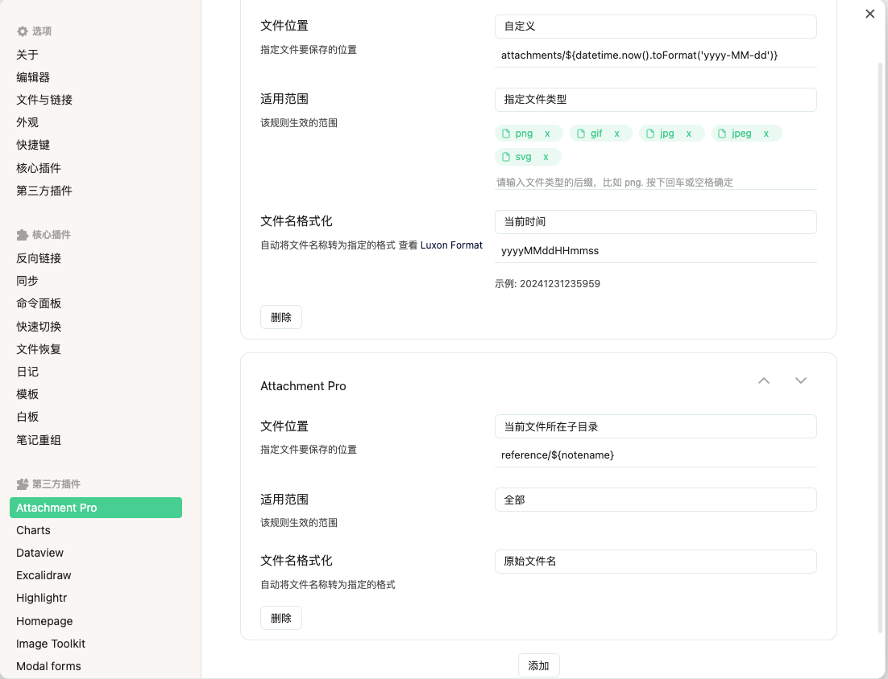
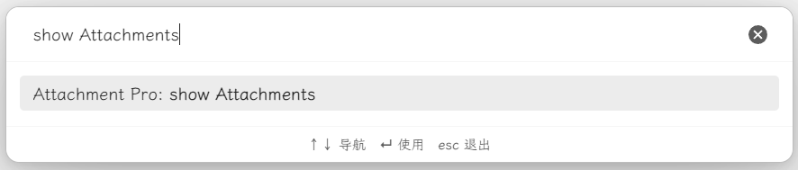

## 介绍

attachmentPro 是一款 obsidian 附件管理插件，支持设置多个附件管理规则。

附件的规则优先级是按照设置的顺序来的，比如设置了两个规则，第一个规则的适用范围是 `指定目录`，第二个规则的适用范围是 `全部`，那么第一个规则会优先生效。

## 文件存放位置

| 选项 | 说明 |
| --- | --- |
| 仓库的根目录 | obsidian 笔记库的所在目录 |
| 当前文件所在目录 | 即保存到所粘贴的笔记所在的目录下，比如笔记是 `notes/2024-01-01.md`，那么图片会保存在 `notes` 目录下 |
| 当前文件所在子目录 | 需要指定一个目录路径，比如笔记是 `notes/2024-01-01.md`，如果指定的子目录是 `attachments`，那么附件会保存到 `notes/attachments/` 下 |
| 自定义 | 可以引用变量（见下文），比如指定规则为 `${yearmonth}/`，插件就会将附件按年月分组保存在不同的目录下 |

## 适用范围

适用范围是指插件会在哪些笔记中、或者针对哪些附件生效，目前支持 4 种类型

| 选项 | 说明 |
| --- | --- |
| 指定目录 | 只有笔记在指定的目录路径下才会应用该附件管理规则 |
| 指定标签 | 笔记中包含指定标签时，才会应用该附件管理规则 |
| 指定文件类型 | 附件类型，比如 `png`、`pdf` 等 |
| 全部 | 适用于所有笔记，以及所有附件类型 |

## 文件名格式化

即重命名附件的名称，支持 4 种方式 

| 选项 | 说明 |
| --- | --- |
| 原始文件名 | 不做任何处理 |
| 当前时间 | 以当前时间作为附件名称，可以自定义时间的格式 |
| UUID | 生成一个唯一的 UUID |
| 自定义格式 | 可以引用变量（见下文），比如笔记为 `2024-01-01`，重命名规则为 `${notename}-${timestamp}`，插件就会将附件重命名为 `2024-01-01-1708144120727` |

## 变量

| 变量名 | 描述 | 示例 |
| --- | --- | --- |
| ${attachmentName} | 附件名称 |  |
| ${notename} | 笔记名称 |  |
| ${timestamp} | 时间戳 | 1708144120727 |
| ${now} | 当前时间，可以通过 ${now.toFormat('yyyyMMddHHmmss')} 来格式化 |  |
| ${year} | 年 | 2024 |
| ${yearmonth} | 年月 | 202401 |
| ${file} | Obsidian 笔记文件对象 | |
| ${frontmatter} | Obsidian 笔记 frontmatter 对象, 可以引用笔记的属性，比如 ${frontmatter.created} 就表示应用了 created 属性 | |

## 附件库使用方法
- `ctrl+p`(默认快捷键)打开obsidian命令窗口，
- 输入`Show Attachments`，选择`Attachment Pro: Show Attachments`命令，打开附件库。

**或者**

- 在左侧 边栏中点击`Show Attachments`图标，打开附件库。
